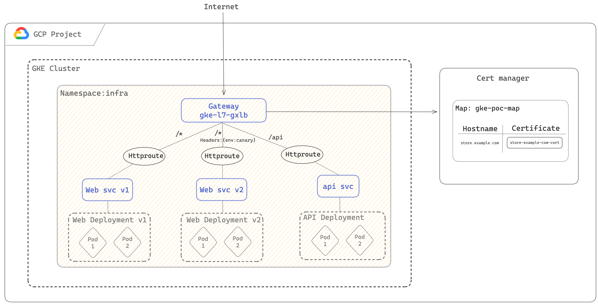

# GKE Gateway Demo: All in one namespace

# Overview



GatewayClass "gke-l7-global-external-managed" will deploy a Global external Application Load Balancer.

# Steps

## Step 1: deploy Self managed certificate.

[Create a private key and certificate](https://cloud.google.com/load-balancing/docs/ssl-certificates/self-managed-certs#create-key-and-cert) Then upload the certificate to certificate manager :

```bash
gcloud certificate-manager certificates create store-example-com-cert \
    --certificate-file="CERTIFICATE_FILE" \
    --private-key-file="PRIVATE_KEY_FILE"
```

Create a certificate Map :

```bash
gcloud certificate-manager maps create gke-poc-map
```

Create a certificate map entry:

```bash
gcloud certificate-manager maps entries create store-example-com-map-entry \
    --map="gke-poc-map" \
    --certificates="store-example-com-cert" \
    --hostname="store.example.com"
```

## Step 2: Create infra namespace

```bash
kubectl create namespace infra
```

## Step 3: Deploy the gateway

```bash
kubectl apply -f gateway.yaml
```

## Step 4: Create web and api deployments & services

```bash
kubectl apply -f web.yaml
kubectl apply -f api.yaml
```

## Step 5: Invoking the gateway

Go to GCP > network Services > Load balancing, get the IP of the load balancer and submit a http get requests

```
response 404 (backend NotFound), service rules for the path non-existent
```

## Step 6: create http routes

```bash
kubectl apply -f routes.yaml
```

## Step 7: Invoke the gateway

```bash
curl -ki https://store.example.com --resolve store.example.com:443:xx.xx.xx.xx
```

```json
{
  "cluster_name": "gke-auto-715",
  "host_header": "store.example.com",
  "metadata": "web-v1",
  "pod_name": "web-v1-759fc9b758-bnz72",
  "pod_name_emoji": "🤦🏼‍♂",
  "project_id": "****************",
  "timestamp": "2024-05-20T17:39:35",
  "zone": "europe-west1-b"
}
```

```bash
 curl -H "env: canary" -ki https://store.example.com --resolve store.example.com:443:xx.xx.xx.xx
```

```json
{
  "cluster_name": "gke-auto-715",
  "host_header": "store.example.com",
  "metadata": "web-v2",
  "pod_name": "web-v2-79599c44c6-pcrdv",
  "pod_name_emoji": "⏭",
  "project_id": "****************",
  "timestamp": "2024-05-20T17:40:45",
  "zone": "europe-west1-c"
}
```

```bash
curl -ki https://store.example.com/api --resolve store.example.com:443:xx.xx.xx.xx
```

```json
{
  "cluster_name": "gke-auto-715",
  "host_header": "store.example.com",
  "metadata": "api",
  "pod_name": "api-9b9787876-zgpr7",
  "pod_name_emoji": "🪡",
  "project_id": "****************",
  "timestamp": "2024-05-20T17:41:04",
  "zone": "europe-west1-c"
}
```
