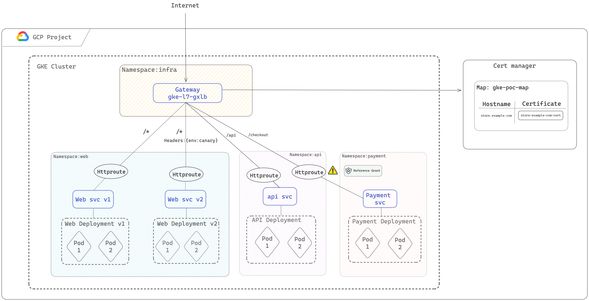

# GKE Gateway Demo: Cross namespace Load balancing

# Overview



GatewayClass "gke-l7-global-external-managed" will deploy a Global external Application Load Balancer.

# Steps
## Step 1: deploy Self managed certificate.

[Create a private key and certificate](https://cloud.google.com/load-balancing/docs/ssl-certificates/self-managed-certs#create-key-and-cert) Then upload the certificate to certificate manager :
```bash
gcloud certificate-manager certificates create store-example-com-cert \
    --certificate-file="CERTIFICATE_FILE" \
    --private-key-file="PRIVATE_KEY_FILE"
```

Create a certificate Map :
```bash
gcloud certificate-manager maps create gke-poc-map
```

Create a certificate map entry:
```bash
gcloud certificate-manager maps entries create store-example-com-map-entry \
    --map="gke-poc-map" \
    --certificates="store-example-com-cert" \
    --hostname="store.example.com"
```

## Step 2: Create namespaces
```bash
kubectl create namespace infra
kubectl create namespace web
kubectl create namespace api
kubectl create namespace payment
```

## Step 3: Deploy the gateway
```bash
kubectl apply -f gateway.yaml
```

## Step 4: Create web, api and payment deployments & services
```bash
kubectl apply -f web.yaml
kubectl apply -f api.yaml
kubectl apply -f payment.yaml

```

## Step 5: Invoking the gateway

Go to GCP > network Services > Load balancing, get the IP of the load balancer and submit a http get requests
```
response 404 (backend NotFound), service rules for the path non-existent
```

## Step 6: create http routes
```bash
k apply -f web-route.yaml
k apply -f api-route.yaml
k apply -f payment-route.yaml
```

## Step 5: Invoke the gateway
```bash
curl -ki https://store.example.com --resolve store.example.com:443:xx.xx.xx.xx
```

```json
{
  "cluster_name": "gke-auto-715",
  "host_header": "store.example.com",
  "metadata": "web-v1",
  "pod_name": "web-v1-759fc9b758-l42h4",
  "pod_name_emoji": "👨🏾‍🦱",
  "project_id": "****************",
  "timestamp": "2024-05-20T18:19:00",
  "zone": "europe-west1-b"
}
```

```bash
 curl -H "env: canary" -ki https://store.example.com --resolve store.example.com:443:xx.xx.xx.xx
```
```json
{
  "cluster_name": "gke-auto-715",
  "host_header": "store.example.com",
  "metadata": "web-v2",
  "pod_name": "web-v2-79599c44c6-f65km",
  "pod_name_emoji": "🆙",
  "project_id": "****************",
  "timestamp": "2024-05-20T18:19:13",
  "zone": "europe-west1-d"
}
```
```bash
curl -ki https://store.example.com/api --resolve store.example.com:443:xx.xx.xx.xx
```
```json
{
  "cluster_name": "gke-auto-715",
  "host_header": "store.example.com",
  "metadata": "api",
  "pod_name": "api-9b9787876-658dr",
  "pod_name_emoji": "👩🏻‍❤️‍💋‍👨🏼",
  "project_id": "****************",
  "timestamp": "2024-05-20T18:19:34",
  "zone": "europe-west1-c"
}
```
## Step 7: Inspect the gateway and notice how many routes are bind.
What is the route that is not bind to the gateway and why ?

**Tips**: Check cluster events

## Step 8: Create a reference grant (⚠️ not yet supported by GKE)
A ReferenceGrant can be used to enable cross namespace references within Gateway API. In this case we would like to allow a Route in api namespace to forward traffic to the payment backends in the payment namespace.
```bash
kubectl apply -f ref_grant.yaml
```
