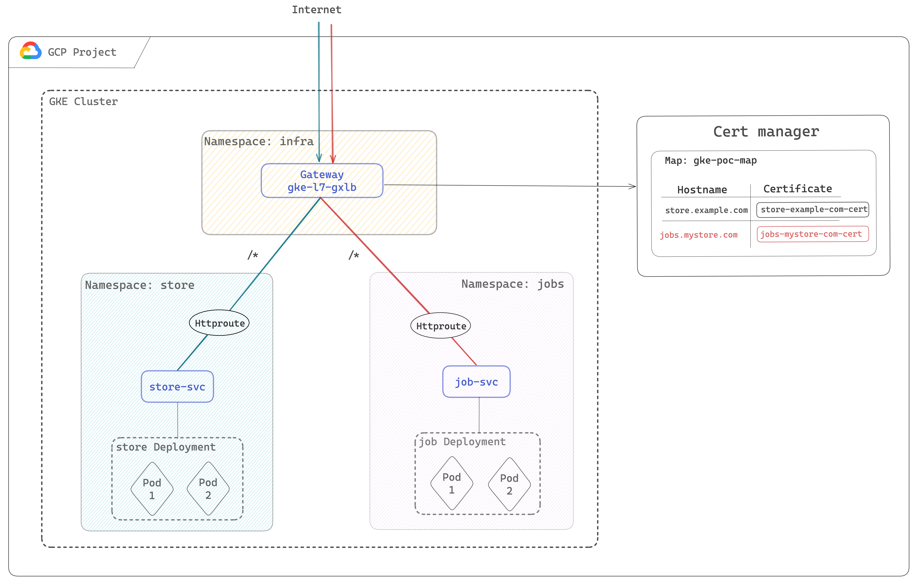

# GKE Gateway Demo: Multi-domain LB config

# Overview



GatewayClass "gke-l7-global-external-managed" will deploy a Global external Application Load Balancer.

# Steps
## Step 1: deploy Self managed certificate.

[Create a private key and a certificate](https://cloud.google.com/load-balancing/docs/ssl-certificates/self-managed-certs#create-key-and-cert) for each domain ("jobs.mystore.com" and "store.example.com") Then upload the certificate to certificate manager with this command:
```bash
gcloud certificate-manager certificates create store-example-com-cert \
    --certificate-file="CERTIFICATE_FILE" \
    --private-key-file="PRIVATE_KEY_FILE"
```

Create a certificate Map:
```bash
gcloud certificate-manager maps create gke-poc-map
```

Create a certificate map entry for each domain:
```bash
gcloud certificate-manager maps entries create store-example-com-map-entry \
    --map="gke-poc-map" \
    --certificates="store-example-com-cert" \
    --hostname="store.example.com"

gcloud certificate-manager maps entries create 	jobs-mystore-com-map-entry \
    --map="gke-poc-map" \
    --certificates="jobs-mystore-com-cert" \
    --hostname="jobs.mystore.com"

# You can verify map entries after creation with:
gcloud certificate-manager maps entries list --map gke-poc-map
```

## Step 2: Create namespaces
```bash
kubectl create namespace jobs
kubectl create namespace store
```

## Step 3: Deploy the gateway
```bash
kubectl apply -f gateway.yaml
```

## Step 4: Create store and job deployments & services
```bash
kubectl apply -f jobs.yaml
kubectl apply -f store.yaml
```

## Step 5: Invoking the gateway

Go to GCP > network Services > Load balancing, get the IP of the load balancer and submit a http get requests
```
response 404 (backend NotFound), service rules for the path non-existent
```

## Step 6: create http routes
```bash
k apply -f jobs-routes.yaml
k apply -f store-routes.yaml
```

## Step 5: Invoke the gateway

```bash
 curl -ki https://store.example.com --resolve store.example.com:443:xx.xx.xx.xx
```
```json
{
  "cluster_name": "gke-auto-715",
  "gce_instance_id": "7444740758862956680",
  "gce_service_account": "par-hnaien-sandbox.svc.id.goog",
  "host_header": "store.example.com",
  "metadata": "store",
  "pod_name": "store-85df86886f-c86zf",
  "pod_name_emoji": "🇧🇾",
  "project_id": "par-hnaien-sandbox",
  "timestamp": "2024-05-20T21:36:53",
  "zone": "europe-west1-c"
}
```

```bash
curl -ki https://jobs.mystore.com/ --resolve jobs.mystore.com:443:xx.xx.xx.xx
```

```json
{
  "cluster_name": "gke-auto-715",
  "gce_instance_id": "7444740758862956680",
  "gce_service_account": "par-hnaien-sandbox.svc.id.goog",
  "host_header": "jobs.mystore.com",
  "metadata": "jobs",
  "pod_name": "jobs-676c695cf7-q9j66",
  "pod_name_emoji": "🧑🏼‍🔬",
  "project_id": "par-hnaien-sandbox",
  "timestamp": "2024-05-20T21:37:14",
  "zone": "europe-west1-c"
}
```
